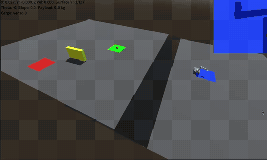
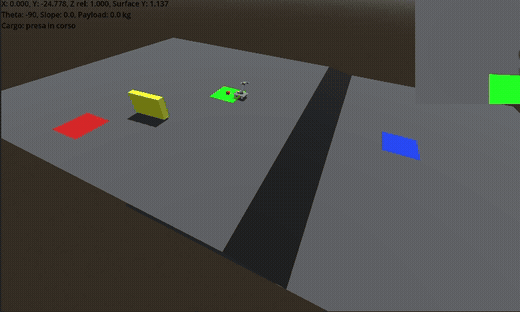
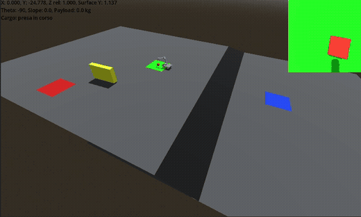
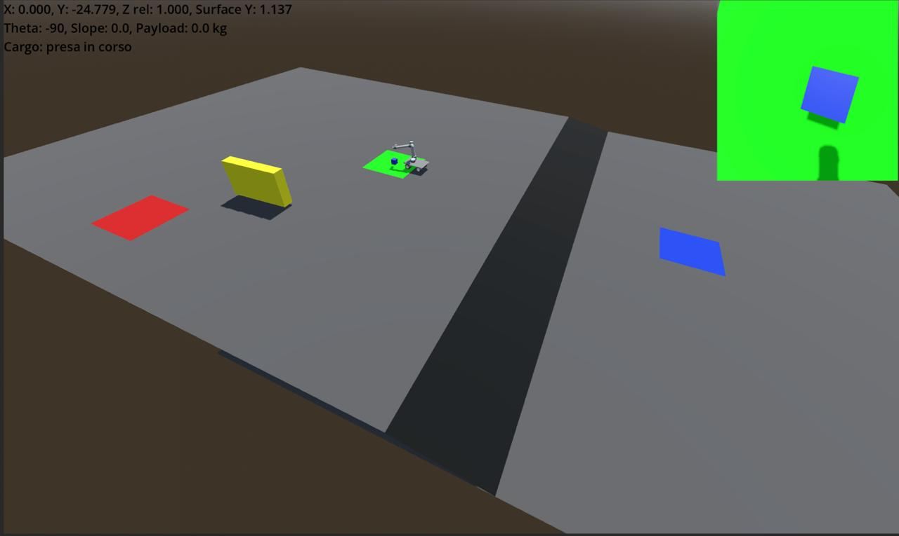

# Robotic System Shuttle

Robotic System Shuttle is a Python + Godot simulation of an autonomous Ackermann shuttle with a 4-joint robotic arm. The robot starts from Zone A, reaches the loading shelf in Zone B, picks one package, classifies it by color, transports it, and drops it in the correct unloading zone.

The project currently implements:

- one loading zone: Zone B, colored in green;
- two unloading zones: Zone A and Zone C;
- color-based routing: blue packages go to Zone A, red packages go to Zone C;
- Ackermann locomotion with load mass and slope effects;
- robotic arm;
- vision-based pick alignment;
- path planning with fixed grid decomposition (NF1);
- DDS communication between Python and Godot;
- live simulation plots for speed, steering, arm joints, slope, payload and mission state.

## Repository Structure

```text
controller/
  run_full_simulation.py      Main Python simulation entry point
  ackermann_mission.py        Mission state machine and high-level control
  mission_config.py           Mission points, zones, tolerances and tuning values
  mission_motion.py           NF1 trajectory wrapper and command smoothing
  nf1.py                      NF1 grid planner
  world.py                    Fixed grid world and rectangular obstacles
  manipulator_control.py      Arm PID control around inverse kinematics
  states/                     Mission states

lib/
  dds/                        UDP DDS-like bridge with Godot
  system/cart.py              Ackermann cart, load, slope and transfer zones
  system/manipulator.py       Arm kinematics and joint dynamics
  system/controllers.py       PID controller implementation
  system/polar.py             Polar position controller
  system/object_finder.py     Color object detection
  data/dataplot.py            Matplotlib plotting helpers

ackermann/
  cars/TestWorld.tscn         Main Godot scene
  cars/demo_car.gd            Godot cart visualizer
  cars/package_spawner.gd     Fixed package spawn with random color
  cars/cargo_visualizer.gd    Carried/delivered package visualization
  arm4/robot_arm.gd           Godot arm visualization
  Components/DDS/             Godot DDS bridge
```

## Demo

The full demo video is available as `video.mp4`. The README also includes short GIF clips extracted from that video to show the main mission phases.

### Drive From Zone A To Zone B

The shuttle starts from Zone A and follows the planned NF1 path toward the loading shelf in Zone B.



### Package Pick And Loading

In Zone B, the arm scans for the package, aligns using the camera-based vision pipeline, moves down to the package and loads it onto the cart.



### Transport And Unloading

After the package color is detected, the mission selects the correct unloading zone and the robot releases the payload there.




### Color-Based Routing

The route is selected after the package color is detected:

```text
blue -> Zone A
red  -> Zone C
```

The mapping is configured in:

```text
controller/mission_config.py
```

### Path planning

The shuttle path is planned on a fixed grid using NF1. Obstacles are defined as rectangular blocks in mission coordinates:

Each obstacle is represented as:

```text
((center_x, center_y), (width, height))
```

Before the obstacle is inserted into the grid world, `mission_motion.py` converts this center-size representation into the two opposite corners required by `World.add_rectangle_obstacle()`:

```text
min_corner = (center_x - width / 2, center_y - height / 2)
max_corner = (center_x + width / 2, center_y + height / 2)
```

The planner treats the vehicle position as the cart reference point used by the controller, so the obstacle is expanded with `obstacle_padding` before it is inserted into the grid. This keeps the planned path away from the obstacle border and gives the robot physical clearance instead of planning exactly along the rectangle edges.


### Simulation Plots

`run_full_simulation.py` collects and displays plots at the end of the simulation:

- target speed vs current speed;
- steering angle;
- arm joint angles: theta0, theta1, theta2, theta3;
- payload, height, slope and mission state.




## Control Pipeline

The control system is structured top-down.

### 1. Mission State Machine

The mission is coordinated by:

```text
controller/ackermann_mission.py
```

The implemented states are:

```text
DRIVE_TO_B
PICK_APPROACH
VISION_PICK
PICK_DOWN
PICK_LIFT_SAFE
DRIVE_TO_UNLOAD
DROP_APPROACH
DROP_DOWN
DROP_LIFT_SAFE
DONE
```

The state machine decides what the robot should do next: drive to a zone, move the arm, perform vision tracking, load the package, unload it, or finish.

### 2. Path Planning

When driving, the mission asks `NF1Path2DMotion` for the next waypoint.

The planner:

1. builds a grid around the start and target points;
2. inserts fixed rectangular obstacles;
3. expands obstacles using padding;
4. runs NF1 from target to start;
5. returns a waypoint path in mission coordinates.

The path is cached for repeated routes.

### 3. Polar Position Controller

The next waypoint is converted into vehicle commands by the polar controller:

The controller outputs:

```text
target_speed
steering_angle
```

The default controller is configured as:

```python
Polar2DController(
    0.8,              # distance gain
    2.0,              # maximum target speed
    0.9,              # angular gain
    math.radians(40), # maximum steering angle
)
```

The distance gain decides how strongly the robot increases its target speed when it is far from the waypoint. The maximum target speed caps that request so the cart does not accelerate indefinitely. The angular gain decides how aggressively the cart points toward the waypoint. The maximum steering angle limits the steering command to a physically reasonable value.

### 4. Speed PID

The cart speed is controlled by a PID:

```python
PID_Controller(10.0, 0, 0, 100.0)
```

It receives the speed error:

```text
target_speed - current_speed
```

and outputs wheel torque.

### 5. Command Smoothing

`CommandSmoother` limits abrupt changes in:

```text
target speed
torque
steering angle
```

The limits are configured in `AckermannMissionConfig`:

```python
max_target_speed_rate = 1.0
max_torque_rate = 100.0
max_steering_rate = math.radians(60)
```

### 6. Vehicle Dynamics

The final command is applied to `AckermannSlopeLoad.evaluate()`:

```text
torque
steering_angle
delta_t
```

The vehicle model updates:

```text
x, y, z
theta
linear speed
angular speed
travelled distance
slope
payload mass
```

## Kinematics And Dynamics

### Ackermann Cart Kinematics

The cart pose is:

```text
(x, y, theta)
```

The steering angle defines the curvature radius:

```text
R = wheelbase / tan(steering_angle)
```

The angular speed is:

```text
w = v / R
```

The horizontal displacement is projected using the current heading:

```text
x += ds * cos(theta)
y += ds * sin(theta)
theta += w * delta_t
```

### Ackermann Cart Dynamics

The cart includes torque, friction, payload mass and slope:


```text
drive_force = torque / wheel_radius
slope_force = total_mass * g * sin(alpha)
friction_force = b * v
acceleration = (drive_force - friction_force - slope_force) / total_mass
```

The payload directly changes:

```text
total_mass = cart_mass + payload_mass
```

This means the same torque produces lower acceleration when the robot is carrying a package.

### Terrain And Slope

Godot measures terrain height and slope. Python receives these values and updates the terrain estimate:

```python
terrain.update(cart.s, terrain_height, terrain_slope)
```

In the Godot scene, the slope is simulated using a raycast-based terrain measurement. This behaves like a simplified onboard sensor: Godot samples the ground under the vehicle and publishes the current height and inclination to Python. Without this feedback, the Python dynamics would only move the robot on a flat mathematical plane, and ramps would not affect the cart acceleration or vertical position.

The cart then uses:

```text
height_at(distance)
slope_at(distance)
```

to compute vertical position and gravity along the slope.

### Robotic Arm Kinematics

The arm is modeled as a 4-joint manipulator:

- joint 0 rotates the arm around the vertical axis;
- joints 1, 2 and 3 solve the planar reach problem;
- inverse kinematics converts a target pose `(x, y, z, a)` into joint references.

The base rotation is:

```text
theta0 = atan2(y, x)
```

The planar target distance is:

```text
x_prime = sqrt(x^2 + y^2)
```

Then the 3-joint planar arm solves the remaining `(x_prime, z, alpha)` target.

### Robotic Arm Dynamics And PID

The arm uses nested PID controllers:

- position PID: joint position error -> reference angular velocity;
- speed PID: angular velocity error -> torque.

The control file is:

```text
controller/manipulator_control.py
```

The arm dynamics are implemented in:

```text
lib/system/manipulator.py
```

Gravity is included for the planar arm joints, while the base rotation is modeled without gravity.

## Package Loading And Unloading

The logical payload is managed by:

```text
lib/system/cart.py
```

The transfer zone checks whether the cart is inside the circular loading/unloading radius:

```python
math.hypot(x - center_x, y - center_y) <= radius
```

When the cart is in Zone B and the arm reaches `PICK_DOWN`, the package is loaded:

```text
PayloadMass: 0 -> 5 kg
```

When the cart reaches the selected unload zone and the arm reaches `DROP_DOWN`, the package is unloaded:

```text
PayloadMass: 5 kg -> 0
```

> Note: the zone colors are not intended to be detected directly by the robot camera. The camera detects the package color. The package is generated with fixed size and fixed position, while its color is random between blue and red.


## Vision Pipeline

The vision system uses the Godot camera stream and OpenCV:

1. Python requests an image from Godot;
2. `ObjectFinder` searches for blue/red package blobs;
3. the best detection is selected by area;
4. `VisionPickState` scans with the arm;
5. if a target is stable and centered, the arm stores a pick pose;
6. the detected color selects the unload zone.

Important parameters:

```python
vision_pixel_tolerance = 8
vision_lock_frames = 4
vision_pixel_to_arm_gain = 0.0005
vision_max_adjust_step = 0.04
vision_min_track_area = 2500
vision_track_margin_px = 20
```

## DDS Topics

Python publishes cart state to Godot:

```text
X
Y
Z
Theta
Slope
PayloadMass
MissionState
CargoColorCode
UnloadZoneCode
```

Python also publishes arm state:

```text
theta0
theta1
theta2
theta3
arm_x
arm_y
arm_z
arm_a
```

Godot publishes terrain feedback used as simulated slope-sensor data:

```text
tick
TerrainHeight
TerrainSlope
```

`TerrainHeight` and `TerrainSlope` are the simulated sensor measurements used by the Python vehicle model to include ramp height and gravitational slope effects.

## Running The Simulation

Install Python dependencies:

```bash
pip install -r requirements.txt
```

Open the Godot project:

Run the Python controller:

```bash
python controller/run_full_simulation.py --godot-delta
```

Useful flags:

```bash
--no-vision      disables camera-based pick tracking
--no-plots       disables matplotlib windows
--duration 60    limits simulation duration
```

Example:

```bash
python controller/run_full_simulation.py --godot-delta --no-plots
```

## Tuning Parameters

Main tuning points:

```text
controller/ackermann_mission.py
  speed_controller
  position_controller

controller/mission_config.py
  max_target_speed_rate
  max_torque_rate
  max_steering_rate
  zone_radius
  arrival_threshold
  vision_* parameters

controller/mission_motion.py
  margin
  waypoint_threshold
  lookahead_steps
  obstacle_padding

controller/manipulator_control.py
  arm position PID values
  arm speed PID values
```
